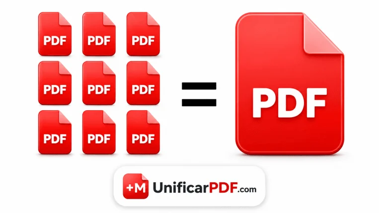

<!-- Floating ghost -->

  

    <svg viewBox="0 0 24 24" fill="none" stroke-width="1.8" stroke-linecap="round" stroke-linejoin="round">
      <path d="M14 2H6a2 2 0 00-2 2v16a2 2 0 002 2h12a2 2 0 002-2V8z"/>
      <polyline points="14 2 14 8 20 8"/>
    </svg>
  

  

<main class="container1">

 <!-- H1 + P — visible before upload, hidden after -->
  <h1 class="page-title" id="pageTitle">Unir PDF Files</h1>
  
Sube tus archivos, organízalos, haz clic en Unir PDF y descarga tu nuevo PDF combinado gratis.

  <!-- UPLOAD STATE (centered, full viewport height) -->
  

    

      

        <svg viewBox="0 0 24 24" fill="none" stroke-width="1.8" stroke-linecap="round" stroke-linejoin="round">
          <path d="M21 15v4a2 2 0 01-2 2H5a2 2 0 01-2-2v-4"/>
          <polyline points="17 8 12 3 7 8"/>
          <line x1="12" y1="3" x2="12" y2="15"/>
        </svg>
      

   <h2>Arrastra tus PDF files aquí</h2>

o haz clic en el botón de abajo para buscar.

      <button class="btn-black" id="browseBtn">
        <svg viewBox="0 0 24 24" fill="none" stroke="currentColor" stroke-width="2" stroke-linecap="round">
          <path d="M21 15v4a2 2 0 01-2 2H5a2 2 0 01-2-2v-4M17 8l-5-5-5 5M12 3v12"/>
        </svg>
  Seleccionar Files
      </button>
     

 Al subir tus files, aceptas nuestros
  <a href="./terminos-de-uso/" target="_blank">Términos de Uso</a>
y nuestra
  <a href="./politica-de-privacidad/" target="_blank">Política de Privacidad</a>.

 
    

    <input type="file" id="fileInput" multiple accept="application/pdf" hidden>
  

  <!-- UPLOADED STATE -->
  

    

      

        Files para unir
        0
        <button class="btn-sm" onclick="sortFiles('asc')">
          <svg viewBox="0 0 12 12" fill="none" stroke-width="1.6" stroke-linecap="round">
            <path d="M1 3h10M3 6h6M5 9h2"/>
          </svg>A-Z
        </button>
        <button class="btn-sm" onclick="sortFiles('desc')">
          <svg viewBox="0 0 12 12" fill="none" stroke-width="1.6" stroke-linecap="round">
            <path d="M1 9h10M3 6h6M5 3h2"/>
          </svg>Z–A
        </button>
      

      

        <button class="btn-add-top" onclick="document.getElementById('moreInput').click()">
          <svg viewBox="0 0 24 24" fill="none" stroke="currentColor" stroke-width="2" stroke-linecap="round">
            <line x1="12" y1="5" x2="12" y2="19"/><line x1="5" y1="12" x2="19" y2="12"/>
          </svg>Add PDF
        </button>
        <button class="btn-merge-top" id="mergeBtnTop" onclick="mergePDFs()">
          <svg viewBox="0 0 24 24" fill="none" stroke="currentColor" stroke-width="2" stroke-linecap="round">
            <path d="M8 6H5a2 2 0 00-2 2v8a2 2 0 002 2h3M16 6h3a2 2 0 012 2v8a2 2 0 01-2 2h-3M12 3v18"/>
          </svg>
Unir PDF
        </button>
      

    

    

    

      

      Uniendo PDFs…
    

  

  <input type="file" id="moreInput" multiple accept="application/pdf" hidden>

  <!-- INFO — only shown before upload -->

 
 <section class="isec-block isec-articles" aria-labelledby="isec-why-title">
    

         Unir múltiples PDF documents en un solo archivo es súper fácil con nuestra herramienta. No pierdas tiempo combinando PDFs de forma manual.
    
 
    

      Nuestro PDF Merger es una herramienta online gratis que te ayuda a juntar, unir y combinar dos o más PDF files al instante
      sin reducir la calidad.
    

    

      Usa tecnología avanzada para unir tus PDF documents de forma rápida, fácil y segura con un solo clic. Combina páginas PDF, organiza tus files y crea un PDF de alta calidad online desde cualquier lugar.
    

  </section>
<section>
   <figure class="isec-media"> 
    
    <figcaption>
        Unir múltiples PDF files en uno al instante
    </figcaption>
</figure>
</section>
  <section class="isec-block isec-articles" aria-labelledby="isec-why-title">
    

       Recibir cientos de PDF files en tu computador desde proyectos del colegio, trabajo de oficina, tareas universitarias, documentos de negocio o labores profesionales puede dificultar el manejo correcto de documentos importantes. Estos files se pueden perder fácilmente o mezclarse con documentos innecesarios si no se organizan a tiempo.
    
 
    

     En vez de guardar múltiples PDF documents por separado, es mejor unirlos y organizarlos en un solo PDF file para un mejor manejo, compartir más fácil, acceso más rápido y almacenamiento seguro. Manejar PDFs en un solo documento ayuda a ahorrar espacio, mejora la productividad y mantiene los files importantes bien organizados.
    

  </section>
  <section class="isec-block isec-why" aria-labelledby="isec-why-title">
    

      <h2 id="isec-why-title" class="isec-block__title">¿Por qué usar UnificarPDF.com para unir PDF files?</h2>
    

    

      

        <svg viewBox="0 0 24 24" fill="none" stroke="currentColor" stroke-width="2" stroke-linecap="round" stroke-linejoin="round"><rect x="8" y="2" width="12" height="16" rx="2"/><path d="M4 6v14a2 2 0 0 0 2 2h10"/></svg>
        
          <svg viewBox="0 0 24 24" fill="none" stroke="currentColor" stroke-width="2" stroke-linecap="round" stroke-linejoin="round"><rect x="8" y="2" width="12" height="16" rx="2"/><path d="M4 6v14a2 2 0 0 0 2 2h10"/></svg>
        
        <h3 class="isec-card__title">Merge de Files Rápido</h3>
        
Este merger online de alta velocidad es ideal para combinar reportes, facturas, páginas escaneadas y documentos de negocio sin demoras. Mejora la eficiencia del workflow y ayuda a los usuarios a manejar sus digital files más fácilmente.

      

      

        <svg viewBox="0 0 24 24" fill="none" stroke="currentColor" stroke-width="2" stroke-linecap="round" stroke-linejoin="round"><circle cx="6" cy="6" r="3"/><circle cx="6" cy="18" r="3"/><path d="M20 4 8.12 15.88"/><path d="M14.47 14.48 20 20"/><path d="M8.12 8.12 12 12"/></svg>
        
          <svg viewBox="0 0 24 24" fill="none" stroke="currentColor" stroke-width="2" stroke-linecap="round" stroke-linejoin="round"><circle cx="6" cy="6" r="3"/><circle cx="6" cy="18" r="3"/><path d="M20 4 8.12 15.88"/><path d="M14.47 14.48 20 20"/><path d="M8.12 8.12 12 12"/></svg>
        
        <h3 class="isec-card__title">Fácil de Usar</h3>
        
Una interfaz sencilla de drag-and-drop permite unir PDF files fácilmente sin conocimientos técnicos. Sube tus documents, reorganiza las páginas y crea un PDF limpio y organizado en pocos clics.

      

      

        <svg viewBox="0 0 24 24" fill="none" stroke="currentColor" stroke-width="2" stroke-linecap="round" stroke-linejoin="round"><path d="M14 2H6a2 2 0 0 0-2 2v16a2 2 0 0 0 2 2h12a2 2 0 0 0 2-2V8z"/><path d="M14 2v6h6"/><path d="M12 18v-6"/><path d="M9 15h6"/></svg>
        
          <svg viewBox="0 0 24 24" fill="none" stroke="currentColor" stroke-width="2" stroke-linecap="round" stroke-linejoin="round"><path d="M14 2H6a2 2 0 0 0-2 2v16a2 2 0 0 0 2 2h12a2 2 0 0 0 2-2V8z"/><path d="M14 2v6h6"/><path d="M12 18v-6"/><path d="M9 15h6"/></svg>
        
        <h3 class="isec-card__title">Procesamiento Seguro de Files</h3>
        
Todos los documents subidos se procesan de forma segura. La herramienta está diseñada con la privacidad en mente, siendo una opción confiable para combinar files sensibles como contratos, reportes financieros y documentos personales. Los files se eliminan automáticamente después del procesamiento.

      

      

        <svg viewBox="0 0 24 24" fill="none" stroke="currentColor" stroke-width="2" stroke-linecap="round" stroke-linejoin="round"><path d="m19 21-7-4-7 4V5a2 2 0 0 1 2-2h10a2 2 0 0 1 2 2z"/></svg>
        
          <svg viewBox="0 0 24 24" fill="none" stroke="currentColor" stroke-width="2" stroke-linecap="round" stroke-linejoin="round"><path d="m19 21-7-4-7 4V5a2 2 0 0 1 2-2h10a2 2 0 0 1 2 2z"/></svg>
        
        <h3 class="isec-card__title">PDF Output de Alta Calidad</h3>
        
Nuestro PDF merge tool conserva el formato original, la claridad de imágenes y la calidad del texto al combinar files. Ya sea para reportes de negocio, notas de estudio o documentos escaneados, el archivo unido final queda profesional, claro y listo para compartir o imprimir.

      

      

        <svg viewBox="0 0 24 24" fill="none" stroke="currentColor" stroke-width="2" stroke-linecap="round" stroke-linejoin="round"><rect x="3" y="3" width="18" height="18" rx="2"/><circle cx="9" cy="9" r="2"/><path d="m21 15-3.1-3.1a2 2 0 0 0-2.8 0L6 21"/></svg>
        
          <svg viewBox="0 0 24 24" fill="none" stroke="currentColor" stroke-width="2" stroke-linecap="round" stroke-linejoin="round"><rect x="3" y="3" width="18" height="18" rx="2"/><circle cx="9" cy="9" r="2"/><path d="m21 15-3.1-3.1a2 2 0 0 0-2.8 0L6 21"/></svg>
        
        <h3 class="isec-card__title">Disponible en todos los sistemas operativos.</h3>
        
La herramienta para unir PDF online está disponible en Windows, Mac, Linux, Android e iPhone sin necesidad de instalar nada.

      

      

        <svg viewBox="0 0 24 24" fill="none" stroke="currentColor" stroke-width="2" stroke-linecap="round" stroke-linejoin="round"><path d="M3 6h18"/><path d="M8 6V4a2 2 0 0 1 2-2h4a2 2 0 0 1 2 2v2"/><path d="M19 6v14a2 2 0 0 1-2 2H7a2 2 0 0 1-2-2V6"/><path d="M10 11v6"/><path d="M14 11v6"/></svg>
        
          <svg viewBox="0 0 24 24" fill="none" stroke="currentColor" stroke-width="2" stroke-linecap="round" stroke-linejoin="round"><path d="M3 6h18"/><path d="M8 6V4a2 2 0 0 1 2-2h4a2 2 0 0 1 2 2v2"/><path d="M19 6v14a2 2 0 0 1-2 2H7a2 2 0 0 1-2-2V6"/><path d="M10 11v6"/><path d="M14 11v6"/></svg>
        
        <h3 class="isec-card__title">Herramienta Gratis y Práctica</h3>
        
Puedes unir PDF gratis online sin costo ni registro. Es una solución práctica para organizar tareas, facturas, ebooks, hojas de vida y files escaneados en un solo PDF document, disponible online en cualquier momento y desde cualquier lugar.

      

      

        <svg viewBox="0 0 24 24" fill="none" stroke="currentColor" stroke-width="2" stroke-linecap="round" stroke-linejoin="round"><path d="M21 12a9 9 0 1 1-9-9c2.52 0 4.85.99 6.57 2.57L21 8"/><path d="M21 3v5h-5"/></svg>
        
          <svg viewBox="0 0 24 24" fill="none" stroke="currentColor" stroke-width="2" stroke-linecap="round" stroke-linejoin="round"><path d="M21 12a9 9 0 1 1-9-9c2.52 0 4.85.99 6.57 2.57L21 8"/><path d="M21 3v5h-5"/></svg>
        
        <h3 class="isec-card__title">Mantiene el orden original de páginas</h3>
        
El orden de las páginas se conserva en todos los files al unirlos, o puedes reorganizarlos como prefieras.

      

      

        <svg viewBox="0 0 24 24" fill="none" stroke="currentColor" stroke-width="2" stroke-linecap="round" stroke-linejoin="round"><path d="M4 14h6v6"/><path d="M20 10h-6V4"/><path d="m14 10 7-7"/><path d="m3 21 7-7"/></svg>
        
          <svg viewBox="0 0 24 24" fill="none" stroke="currentColor" stroke-width="2" stroke-linecap="round" stroke-linejoin="round"><path d="M4 14h6v6"/><path d="M20 10h-6V4"/><path d="m14 10 7-7"/><path d="m3 21 7-7"/></svg>
        
        <h3 class="isec-card__title">Merges Ilimitados, Sin Límite Diario</h3>
        
No hay límite en cuántas veces puedes usar la herramienta en un día. Une un file hoy y cincuenta mañana — la herramienta sigue gratis y disponible siempre.

      

      

        <svg viewBox="0 0 24 24" fill="none" stroke="currentColor" stroke-width="2" stroke-linecap="round" stroke-linejoin="round"><path d="M13 2 3 14h9l-1 8 10-12h-9z"/></svg>
        
          <svg viewBox="0 0 24 24" fill="none" stroke="currentColor" stroke-width="2" stroke-linecap="round" stroke-linejoin="round"><path d="M13 2 3 14h9l-1 8 10-12h-9z"/></svg>
        
        <h3 class="isec-card__title">Sin Watermarks en los Output Files</h3>
        
El PDF unido sale limpio — sin marcas, sellos ni texto de watermark en ninguna parte del file, listo para enviar a un cliente o entregar tal como está.

      

      

        <svg viewBox="0 0 24 24" fill="none" stroke="currentColor" stroke-width="2" stroke-linecap="round" stroke-linejoin="round"><path d="M12 22s8-4 8-10V5l-8-3-8 3v7c0 6 8 10 8 10Z"/><path d="m9 12 2 2 4-4"/></svg>
        
          <svg viewBox="0 0 24 24" fill="none" stroke="currentColor" stroke-width="2" stroke-linecap="round" stroke-linejoin="round"><path d="M12 22s8-4 8-10V5l-8-3-8 3v7c0 6 8 10 8 10Z"/><path d="m9 12 2 2 4-4"/></svg>
        
        <h3 class="isec-card__title">Sin Metadata Inyectada en tu Output</h3>
        
La herramienta no agrega ningún metadata oculto ni información de tracking al PDF unido. El output file está limpio y libre de datos adicionales que puedan comprometer la privacidad o seguridad.

      

    
    

  </section>
  <section class="isec-block isec-how" aria-labelledby="isec-how-title">
    

      <h2 id="isec-how-title" class="isec-block__title">¿Cómo unir PDF files en un solo PDF?</h2>
      
No necesitas hacer mucho para unir PDF files en un solo documento. Si no sabes cómo hacerlo, sigue estos sencillos pasos:

    

    <ol class="isec-steps">
      <li>
        1
        
Sube tus PDF documents o arrastra y suelta los files en el PDF merge tool.

      </li>
     <li> 
        2
        
Organiza y reordena las páginas o files PDF si es necesario.

      </li>
      <li>
        3
        
Haz clic en el botón Unir PDF.

      </li>
      <li>
        4
        
Espera unos segundos mientras la herramienta procesa tus files de forma segura.

      </li>
      <li>
        5
        
Descarga tu nuevo PDF unido al instante o compártelo online.

      </li>
    </ol>
  </section>
  <section class="isec-block isec-usecases" aria-labelledby="isec-usecases-title">
    

      <h2 id="isec-usecases-title" class="isec-block__title">Herramienta para unir PDF para cualquier uso</h2>
      
Mira cómo nuestro PDF Merger te ayuda a organizar fácilmente tus PDF documents.

    

    

      

        <svg viewBox="0 0 24 24" fill="none" stroke="currentColor" stroke-width="2" stroke-linecap="round" stroke-linejoin="round"><rect x="2" y="7" width="20" height="14" rx="2"/><path d="M16 21V5a2 2 0 0 0-2-2h-4a2 2 0 0 0-2 2v16"/></svg>
        
          <svg viewBox="0 0 24 24" fill="none" stroke="currentColor" stroke-width="2" stroke-linecap="round" stroke-linejoin="round"><rect x="2" y="7" width="20" height="14" rx="2"/><path d="M16 21V5a2 2 0 0 0-2-2h-4a2 2 0 0 0-2 2v16"/></svg>
        
        <h3 class="isec-card__title">PDF de Negocios</h3>
        
Las empresas usan PDF mergers para combinar facturas, contratos, reportes y presentaciones en un solo file organizado. Esto facilita compartir documentos y mantiene los registros importantes en un solo lugar.

      

      

        <svg viewBox="0 0 24 24" fill="none" stroke="currentColor" stroke-width="2" stroke-linecap="round" stroke-linejoin="round"><path d="M22 10 12 5 2 10l10 5 10-5Z"/><path d="M6 12v5c0 1.1 2.7 2 6 2s6-.9 6-2v-5"/></svg>
        
          <svg viewBox="0 0 24 24" fill="none" stroke="currentColor" stroke-width="2" stroke-linecap="round" stroke-linejoin="round"><path d="M22 10 12 5 2 10l10 5 10-5Z"/><path d="M6 12v5c0 1.1 2.7 2 6 2s6-.9 6-2v-5"/></svg>
        
        <h3 class="isec-card__title">PDFs de Estudiantes</h3>
        
Los estudiantes pueden unir apuntes, papers de investigación y páginas de tareas en un PDF antes de entregar su trabajo online. Esto ayuda a crear un documento limpio y profesional.

      

      

        <svg viewBox="0 0 24 24" fill="none" stroke="currentColor" stroke-width="2" stroke-linecap="round" stroke-linejoin="round"><path d="M12 3v18"/><path d="M5 7h14"/><path d="m5 7-3 6a3 3 0 0 0 6 0Z"/><path d="m19 7-3 6a3 3 0 0 0 6 0Z"/></svg>
        
          <svg viewBox="0 0 24 24" fill="none" stroke="currentColor" stroke-width="2" stroke-linecap="round" stroke-linejoin="round"><path d="M12 3v18"/><path d="M5 7h14"/><path d="m5 7-3 6a3 3 0 0 0 6 0Z"/><path d="m19 7-3 6a3 3 0 0 0 6 0Z"/></svg>
        
        <h3 class="isec-card__title">Files Escaneados</h3>
        
Cuando los documentos se escanean página por página, un PDF merger puede combinar todas las páginas escaneadas en un solo file. Muy útil para documentos de identidad, formularios y papeleo de oficina.

      

      

        <svg viewBox="0 0 24 24" fill="none" stroke="currentColor" stroke-width="2" stroke-linecap="round" stroke-linejoin="round"><circle cx="18" cy="5" r="3"/><circle cx="6" cy="12" r="3"/><circle cx="18" cy="19" r="3"/><path d="m8.6 10.5 6.8-3.9"/><path d="m8.6 13.5 6.8 3.9"/></svg>
        
          <svg viewBox="0 0 24 24" fill="none" stroke="currentColor" stroke-width="2" stroke-linecap="round" stroke-linejoin="round"><circle cx="18" cy="5" r="3"/><circle cx="6" cy="12" r="3"/><circle cx="18" cy="19" r="3"/><path d="m8.6 10.5 6.8-3.9"/><path d="m8.6 13.5 6.8 3.9"/></svg>
        
        <h3 class="isec-card__title">Viajes y Documentos Personales</h3>
        
Es muy común combinar tiquetes, reservas de hotel, pasaportes y documentos de viaje en un solo PDF para tenerlos a mano. Así evitas el problema de manejar múltiples files por separado.

      

      
      

        
          <svg viewBox="0 0 24 24" fill="none" stroke="currentColor" stroke-width="2" stroke-linecap="round"
            stroke-linejoin="round">
            <path d="M14 2H6a2 2 0 0 0-2 2v16a2 2 0 0 0 2 2h12a2 2 0 0 0 2-2V8z" />
            <path d="M14 2v6h6" />
            <circle cx="10" cy="11" r="2" />
            <path d="M7.5 16c.8-1.5 4.2-1.5 5 0" />
            <path d="M15 11h2" />
            <path d="M15 15h2" />
          </svg>
        
          <svg viewBox="0 0 24 24" fill="none" stroke="currentColor" stroke-width="2" stroke-linecap="round"
            stroke-linejoin="round">
            <path d="M14 2H6a2 2 0 0 0-2 2v16a2 2 0 0 0 2 2h12a2 2 0 0 0 2-2V8z" />
            <path d="M14 2v6h6" />
            <path d="M8 13h8" />
            <path d="M8 17h8" />
            <path d="M8 9h2" />
          </svg>
        
        <h3 class="isec-card__title">Portfolio y Hoja de Vida</h3>
        
Los que buscan trabajo y los diseñadores usan PDF merge tools para combinar hojas de vida, cartas de presentación, certificados y muestras de portfolio en un solo documento profesional fácil de compartir.

      

        

          <svg viewBox="0 0 24 24" fill="none"
              stroke="currentColor" stroke-width="2" stroke-linecap="round" stroke-linejoin="round">
              <circle cx="18" cy="5" r="3" />
              <circle cx="6" cy="12" r="3" />
              <circle cx="18" cy="19" r="3" />
              <path d="m8.6 10.5 6.8-3.9" />
              <path d="m8.6 13.5 6.8 3.9" /></svg>
          
            <svg viewBox="0 0 24 24" fill="none" stroke="currentColor" stroke-width="2" stroke-linecap="round"
              stroke-linejoin="round">
              <circle cx="18" cy="5" r="3" />
              <circle cx="6" cy="12" r="3" />
              <circle cx="18" cy="19" r="3" />
              <path d="m8.6 10.5 6.8-3.9" />
              <path d="m8.6 13.5 6.8 3.9" /></svg>
          
          <h3 class="isec-card__title">Historiales Médicos y de Salud</h3>
          
Pacientes y clínicas unen fórmulas médicas, resultados de laboratorio, formularios de seguro y páginas de historial médico en un solo file, facilitando llevar o compartir los records completos con médicos o aseguradoras.
          

        

    

  </section>
  <section class="isec-block isec-faq" aria-labelledby="isec-faq-title">
    

      <h2 id="isec-faq-title" class="isec-block__title">Preguntas Frecuentes</h2>
      
¿Tienes preguntas? Tenemos las respuestas. Encuentra todo lo que necesitas saber sobre nuestro PDF Merger.

    

    
Para Empezar

    

      

        <button type="button" class="isec-faq__summary" aria-expanded="true">
          ¿Qué es el merge de PDF?
          <svg viewBox="0 0 24 24" fill="none" stroke="currentColor" stroke-width="2" stroke-linecap="round" stroke-linejoin="round"><path d="m6 9 6 6 6-6"/></svg>
        </button>
        

          

            
El merge de PDF es el proceso de combinar dos o más PDF files separados en un solo documento unificado. Nuestra herramienta entrega un merging rápido, seguro y automatizado directamente en tu browser.

          

        

      

      

        <button type="button" class="isec-faq__summary" aria-expanded="false">
          ¿Cómo puedo unir PDF files online?
          <svg viewBox="0 0 24 24" fill="none" stroke="currentColor" stroke-width="2" stroke-linecap="round" stroke-linejoin="round"><path d="m6 9 6 6 6-6"/></svg>
        </button>
        

          

            
Puedes unir PDF en linea subiendo tus documentos a UnificarPDF.com. La herramienta los organiza y combina automáticamente en un solo file en cuestión de segundos.

          

        

      

      

        <button type="button" class="isec-faq__summary" aria-expanded="false">
          ¿Necesito instalar un software para unir PDFs?
          <svg viewBox="0 0 24 24" fill="none" stroke="currentColor" stroke-width="2" stroke-linecap="round" stroke-linejoin="round"><path d="m6 9 6 6 6-6"/></svg>
        </button>
        

          

            
No. Puedes unir PDF online subiendo tus documentos a UnificarPDF.com. La herramienta los organiza y combina automáticamente en un solo file en segundos.

          

        

      

      

        <button type="button" class="isec-faq__summary" aria-expanded="false">
          ¿Necesito crear una cuenta?
          <svg viewBox="0 0 24 24" fill="none" stroke="currentColor" stroke-width="2" stroke-linecap="round" stroke-linejoin="round"><path d="m6 9 6 6 6-6"/></svg>
        </button>
        

          

            
¡No! Puedes empezar a unir de inmediato sin ningún registro, email ni creación de cuenta. Solo sube tus files y listo — así de simple.

          

        

      

      

        <button type="button" class="isec-faq__summary" aria-expanded="false">
          ¿Qué formatos de file se pueden unir?
          <svg viewBox="0 0 24 24" fill="none" stroke="currentColor" stroke-width="2" stroke-linecap="round" stroke-linejoin="round"><path d="m6 9 6 6 6-6"/></svg>
        </button>
        

          

            
UnificarPDF.com está hecho específicamente para combinar PDF files. No convierte otros formatos como Word, Excel o imágenes en PDF.

          

        

      

      

        <button type="button" class="isec-faq__summary" aria-expanded="false">
          ¿Se pueden subir PDF files grandes?
          <svg viewBox="0 0 24 24" fill="none" stroke="currentColor" stroke-width="2" stroke-linecap="round" stroke-linejoin="round"><path d="m6 9 6 6 6-6"/></svg>
        </button>
        

          

            
Sí, la herramienta está diseñada para manejar tanto documentos pequeños como PDFs grandes de múltiples páginas sin comprometer el formato ni la calidad.

          

        

      

      

        <button type="button" class="isec-faq__summary" aria-expanded="false">
          ¿Puedo exportar el file unido en diferentes formatos?
          <svg viewBox="0 0 24 24" fill="none" stroke="currentColor" stroke-width="2" stroke-linecap="round" stroke-linejoin="round"><path d="m6 9 6 6 6-6"/></svg>
        </button>
        

          

            
El output unido se entrega como un solo PDF file, listo para descargar, compartir o imprimir.

          

        

      

      

        <button type="button" class="isec-faq__summary" aria-expanded="false">
          ¿Puedo reorganizar las páginas antes de unir?
          <svg viewBox="0 0 24 24" fill="none" stroke="currentColor" stroke-width="2" stroke-linecap="round" stroke-linejoin="round"><path d="m6 9 6 6 6-6"/></svg>
        </button>
        

          

            
Sí, una vez subidos tus files puedes arrastrarlos y reordenarlos para definir el orden exacto de las páginas antes de combinarlos.

          

        

      

      

        <button type="button" class="isec-faq__summary" aria-expanded="false">
          ¿UnificarPDF.com puede detectar y organizar múltiples files a la vez?
          <svg viewBox="0 0 24 24" fill="none" stroke="currentColor" stroke-width="2" stroke-linecap="round" stroke-linejoin="round"><path d="m6 9 6 6 6-6"/></svg>
        </button>
        

          

            
¡Sí! La herramienta te permite subir varios PDFs juntos, listándolos automáticamente para que puedas organizar el orden del merge de forma visual.

          

        

      

      

        <button type="button" class="isec-faq__summary" aria-expanded="false">
          ¿Puedo unir PDFs en cualquier idioma?
          <svg viewBox="0 0 24 24" fill="none" stroke="currentColor" stroke-width="2" stroke-linecap="round" stroke-linejoin="round"><path d="m6 9 6 6 6-6"/></svg>
        </button>
        

          

            
Sí, la herramienta soporta unir PDFs en cualquier idioma, preservando el texto y el formato.

          

        

      

      

        <button type="button" class="isec-faq__summary" aria-expanded="false">
          ¿Puedo unir PDF files desde dispositivos móviles?
          <svg viewBox="0 0 24 24" fill="none" stroke="currentColor" stroke-width="2" stroke-linecap="round" stroke-linejoin="round"><path d="m6 9 6 6 6-6"/></svg>
        </button>
        

          

            
Sí, UnificarPDF.com es totalmente responsive y funciona perfecto en computadores, tablets y dispositivos móviles.

          

        

      

      

        <button type="button" class="isec-faq__summary" aria-expanded="false">
          ¿Es UnificarPDF.com apto para uso empresarial y académico?
          <svg viewBox="0 0 24 24" fill="none" stroke="currentColor" stroke-width="2" stroke-linecap="round" stroke-linejoin="round"><path d="m6 9 6 6 6-6"/></svg>
        </button>
        

          

            
Claro que sí. Es ideal para combinar reportes, facturas, contratos, papers de investigación y páginas de tareas en documentos claros y organizados.

          

        

      

      

        <button type="button" class="isec-faq__summary" aria-expanded="false">
          ¿Mis datos están seguros al unir PDFs?
          <svg viewBox="0 0 24 24" fill="none" stroke="currentColor" stroke-width="2" stroke-linecap="round" stroke-linejoin="round"><path d="m6 9 6 6 6-6"/></svg>
        </button>
        

          

            
Sí, tus datos están seguros al usar UnificarPDF.com. Implementamos medidas de seguridad estándar de la industria para proteger tus files durante el proceso de merge.

          

        

      

      

        <button type="button" class="isec-faq__summary" aria-expanded="false">
          ¿En qué se diferencia UnificarPDF.com de Adobe Acrobat para hacer merge?
          <svg viewBox="0 0 24 24" fill="none" stroke="currentColor" stroke-width="2" stroke-linecap="round" stroke-linejoin="round"><path d="m6 9 6 6 6-6"/></svg>
        </button>
        

          

            
UnificarPDF.com ofrece una solución web fácil de usar para unir PDFs sin necesidad de instalar software ni crear una cuenta. A diferencia de Adobe Acrobat, que requiere suscripción paga y software de escritorio, UnificarPDF.com es una alternativa gratis y accesible que funciona directamente en tu browser.

          

        

      

      

        <button type="button" class="isec-faq__summary" aria-expanded="false">
          ¿Puedo unir PDFs sin conexión a internet?
          <svg viewBox="0 0 24 24" fill="none" stroke="currentColor" stroke-width="2" stroke-linecap="round" stroke-linejoin="round"><path d="m6 9 6 6 6-6"/></svg>
        </button>
        

          

            
No, esta herramienta procesa los files en el servidor, por lo que se necesita conexión a internet. Para hacer merge completamente offline, se necesitaría una herramienta de escritorio.

          

        

      

     
    

  </section>
  <section>
        

      <h2 id="isec-why-title" class="isec-block__title">Problemas Comunes al Unir PDFs: Problemas y Soluciones</h2>
    

    

  <table class="isec-table">
    <thead>
      <tr>
        <th>Problema</th>
        <th>Solución</th>
      </tr>
    </thead>
    <tbody>
      <tr>
        <td>Los files no se están uniendo correctamente.</td>
        <td>Asegúrate de que todos los <a href="https://en.wikipedia.org/wiki/PDF" class="alink">PDF files</a> no estén dañados y vuelve a subir los files que falten.</td>
      </tr>
      <tr>
        <td>El botón de merge no funciona.</td>
        <td>Recarga la página, desactiva las extensiones del browser o intenta usar la última versión de Chrome.</td>
      </tr>
      <tr>
        <td>Orden incorrecto de files.</td>
        <td>Reorganiza manualmente los files antes de unirlos, o renómbralos usando números para mantenerlos en la secuencia correcta.</td>
      </tr>
    </tbody>
  </table>

  </section>



  
    
  
    
  
  
    

      <a href="{{ post.url | relative_url }}">
        

          
        

      </a>
      
        
        
        <a class="relatedbloganywhere-category" href="{{ site.baseurl }}/category/{{ cat_slug }}/">
          {{ cat_page.title | default: cat_slug | replace: "-", " " }}
        </a>
      
      

        <a href="{{ post.url | relative_url }}">
          <h3>{{ post.title }}</h3>
        </a>
      

    

  

    
  

</main>

<!-- BOTTOM BAR (mobile) -->

  <button class="add-btn" onclick="document.getElementById('moreInput').click()">
    <svg viewBox="0 0 24 24" fill="none" stroke-width="2" stroke-linecap="round">
      <line x1="12" y1="5" x2="12" y2="19"/><line x1="5" y1="12" x2="19" y2="12"/>
    </svg>Add
  </button>
  <button class="btn-merge-full" id="mergeBtnBottom" onclick="mergePDFs()">
    <svg viewBox="0 0 24 24" fill="none" stroke="currentColor" stroke-width="2" stroke-linecap="round">
      <path d="M8 6H5a2 2 0 00-2 2v8a2 2 0 002 2h3M16 6h3a2 2 0 012 2v8a2 2 0 01-2 2h-3M12 3v18"/>
    </svg>Merge PDF
  </button>

<!-- FOOTER — hidden until files uploaded -->

